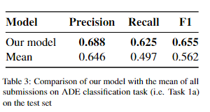
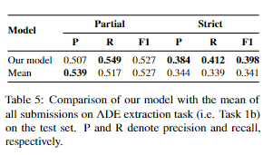

# BOUN-TABI@SMM4H'22: Text-to-Text Adverse Drug Event Extraction with Data Balancing and Prompting

This repository contains the implementation of the systems developed for the the Social Media Mining for Health (SMM4H) 2022 Shared Task. We developed two separate systems for detecting adverse drug events (ADEs) in English tweets (Task 1a) and extracting ADE spans in such tweets (Task 1b). Our models rely on the T5 model and formulation of these tasks as sequence-to-sequence problems. To address the class imbalance, we used oversampling/undersampling on both tasks. For the ADE extraction task, we explored prompting to further benefit from the T5 model and its formulation. We built an ensemble model, which combines a model trained on oversampling/undersampling and another one trained with prompting. 

## Dataset

The dataset was provided by the organizers of the shared task and not publicly available. Once you obtained the data by contacting the organizers, you may run the following script to preprocess it:


```bash
python prepare_data.py <data_dir> 
```

Data with prompt templates can be produced by:

```bash
python prompt_data.py <data_dir> 
```

## Training

After the required data sets are obtained, models can be trained with:

```bash
python train.py <task_prefix> <task_name> <input_data_dir> <model_output_dir>
```

where `<task_prefix` is `assert_ade` or `ner_ade` and `task_name` is either `smm4h_task1` for ADE classification of `smm4h_task2` for ADE extraction. 

## Ensemble

To ensemble model predictions, a config file is needed where models and output files are specified. See `config` directory for examples. Once a config file is ready, new predictions can be produced by:  

```bash
python ensemble.py <path-to-config-file>
```

## Results

### Task 1a: ADE classification



### Task 1b: ADE Extraction



### Citation

```

```

### Reference

```
@inproceedings{raval2021exploring,
  title={Exploring a Unified Sequence-To-Sequence Transformer for Medical Product Safety Monitoring in Social Media},
  author={Raval, Shivam and Sedghamiz, Hooman and Santus, Enrico and Alhanai, Tuka and Ghassemi, Mohammad and Chersoni, Emmanuele},
  booktitle={The 2021 Conference on Empirical Methods in Natural Language Processing},
  year={2021},
  organization={Association for Computational Linguistics (ACL)}
}
```

